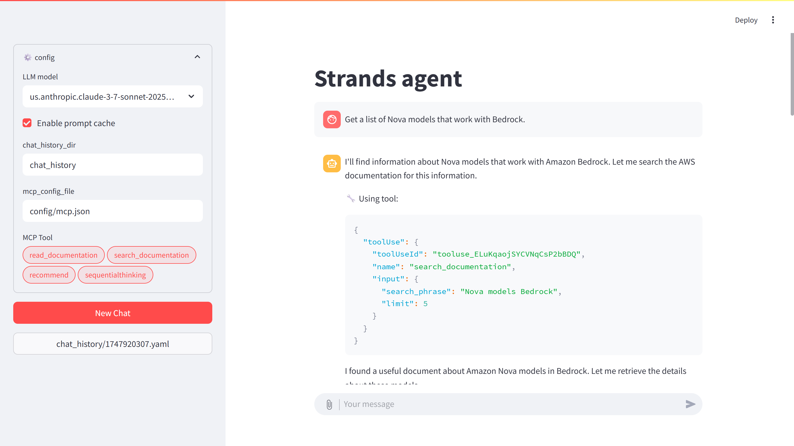

# Strands Agent Streamlit チャットアプリ

StrandsフレームワークとAWS Bedrockモデルを活用したAIエージェントと対話するためのStreamlitベースのチャットアプリケーションです。



## 概要

このアプリケーションは、AWS Bedrockを通じて様々な大規模言語モデル（LLM）と対話するためのチャットインターフェースを提供します。以下の機能をサポートしています：

- 複数のAWS Bedrockモデル（Claude、Nova）
- 画像入力と処理（対応モデルのみ）
- MCP（Model Context Protocol）を通じたツール使用
- チャット履歴管理
- パフォーマンス向上のためのプロンプトキャッシング

## 機能

- **複数モデルサポート**: Amazon NovaやAnthropic Claudeモデルなど、様々なAWS Bedrockモデルから選択可能
- **画像処理**: 画像入力をサポートするモデルで画像のアップロードと処理が可能
- **ツール統合**: MCP（Model Context Protocol）を通じて外部ツールを使用
- **チャット履歴**: 過去の会話を保存・読み込み
- **プロンプトキャッシング**: 設定可能なプロンプトキャッシングでパフォーマンスを最適化

## 前提条件

- Python 3.12以上
- Bedrockアクセス権限を持つAWSアカウント
- 適切に設定されたAWS認証情報
- Docker（一部のMCPツール用）

## インストール

1. リポジトリをクローン：
   ```
   git clone https://github.com/moritalous/strands-agent-streamlit-chat.git
   cd strands-agent-streamlit-chat
   ```

2. 依存関係をインストール：
   ```
   pip install -e .
   ```
   
   またはuvを使用：
   ```
   uv pip install -e .
   ```

## 設定

アプリケーションは2つの主要な設定ファイルを使用します：

### 1. `config/config.json`

以下の設定を含みます：
- チャット履歴ディレクトリ
- MCP設定ファイルパス
- AWS Bedrockリージョン
- モデル設定（以下を含む）：
  - キャッシュサポートオプション
  - 画像サポート機能

例：
```json
{
    "chat_history_dir": "chat_history",
    "mcp_config_file": "config/mcp.json",
    "bedrock_region": "us-east-1",
    "models": {
        "us.amazon.nova-premier-v1:0": {
            "cache_support": [],
            "image_support": true
        },
        "us.anthropic.claude-3-7-sonnet-20250219-v1:0": {
            "cache_support": [
                "system",
                "messages",
                "tools"
            ],
            "image_support": true
        }
    }
}
```

### 2. `config/mcp.json`

ツール統合のためのMCP（Model Context Protocol）サーバーを設定：

例：
```json
{
    "mcpServers": {
        "awsdoc": {
            "command": "uvx",
            "args": [
                "awslabs.aws-documentation-mcp-server@latest"
            ],
            "env": {
                "FASTMCP_LOG_LEVEL": "ERROR"
            }
        },
        "sequentialthinking": {
            "command": "docker",
            "args": [
                "run",
                "--rm",
                "-i",
                "mcp/sequentialthinking"
            ]
        }
    }
}
```

## 使用方法

1. Streamlitアプリケーションを起動：
   ```
   streamlit run app.py
   ```

2. Webインターフェースで：
   - サイドバーのドロップダウンからモデルを選択
   - 必要に応じてプロンプトキャッシングを有効/無効化
   - 使用するMCPツールを選択
   - 新しいチャットを開始または既存のチャットを継続
   - メッセージを入力し、必要に応じて画像をアップロード
   - チャットインターフェースでツールの使用状況を確認

## チャット履歴

チャット履歴は設定されたチャット履歴ディレクトリにYAMLファイルとして保存されます。以下が可能です：
- 「New Chat」ボタンで新しいチャットを開始
- サイドバーでファイル名をクリックして過去のチャットを読み込み

## MCPツール

アプリケーションは様々なMCPツールをサポートします：
- AWSドキュメントツール
- シーケンシャル思考ツール
- MCP設定を通じて追加ツールを追加可能

## 開発

アプリケーションは以下で構築されています：
- Streamlit（Webインターフェース）
- Strandsフレームワーク（エージェント機能）
- AWS Bedrock（LLMアクセス）
- MCP（ツール統合）


## ライセンス

このプロジェクトはApache License 2.0のもとでライセンスされています - 詳細は[LICENSE](LICENSE)ファイルを参照してください。

## 謝辞

- Strands Agentsフレームワーク
- AWS Bedrock
- Streamlit
- MCP（Model Context Protocol）